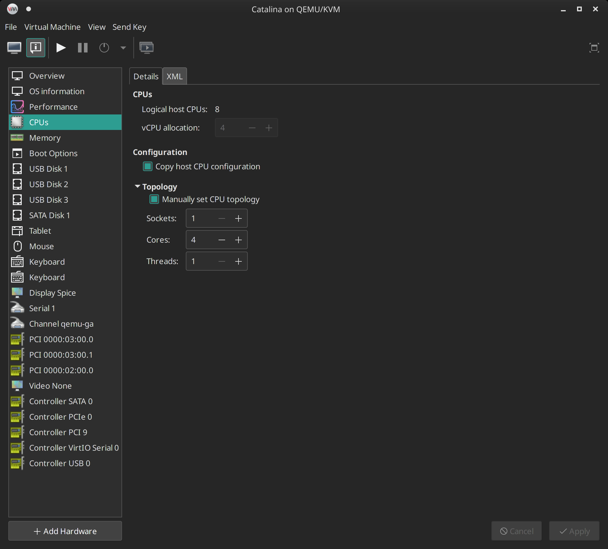
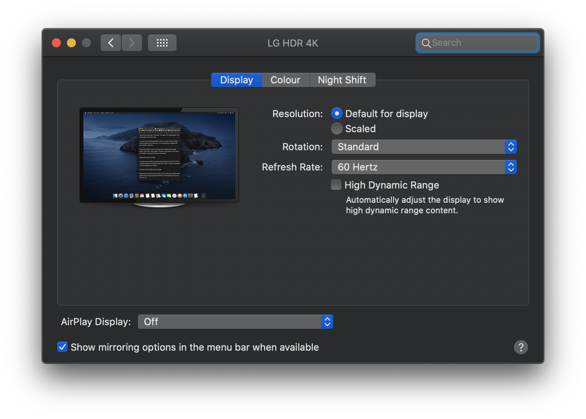
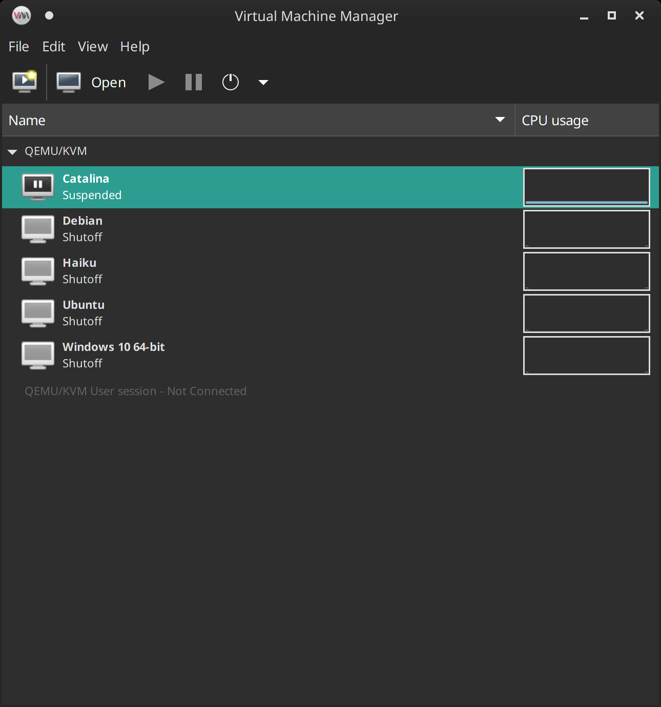
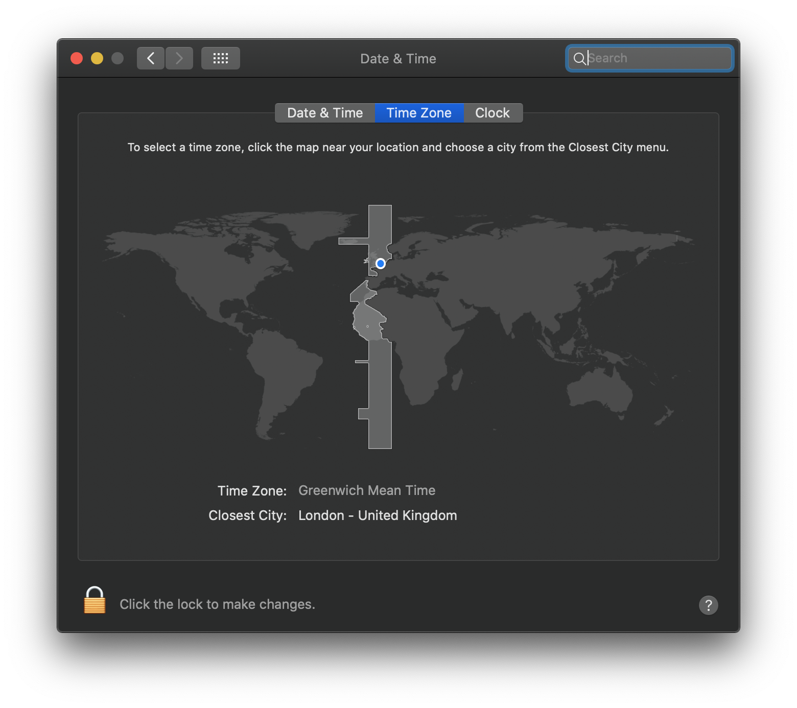
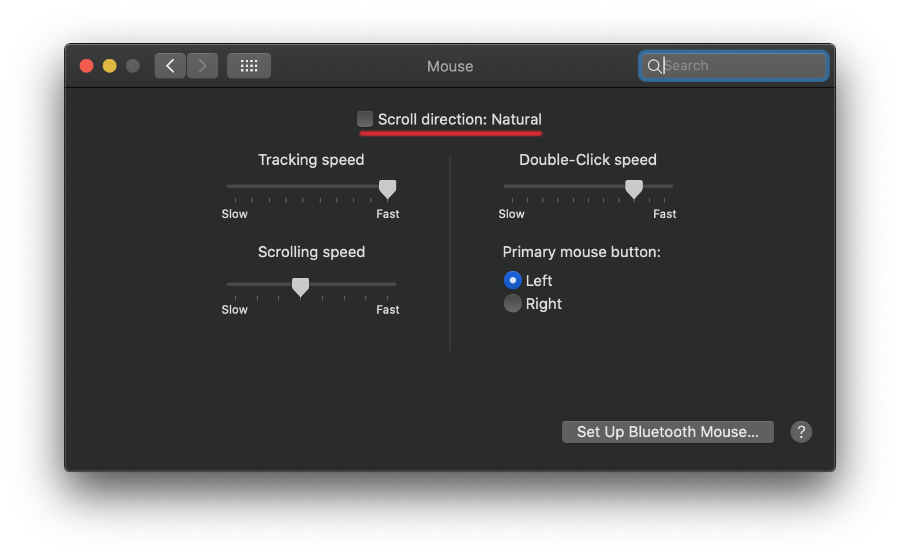
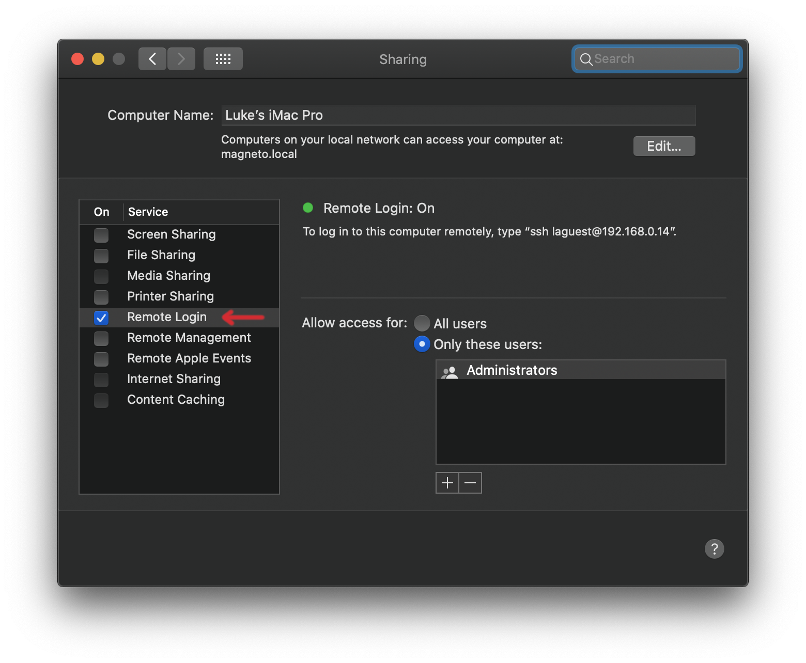
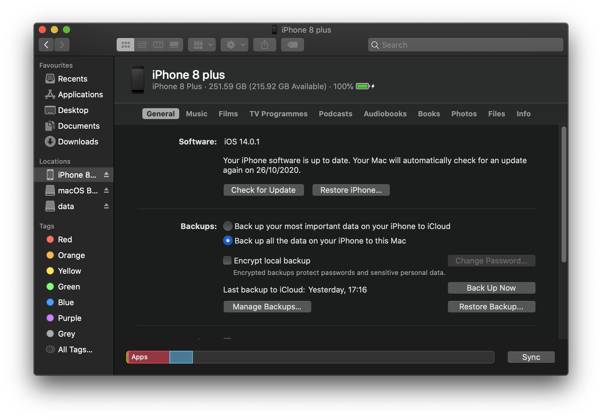
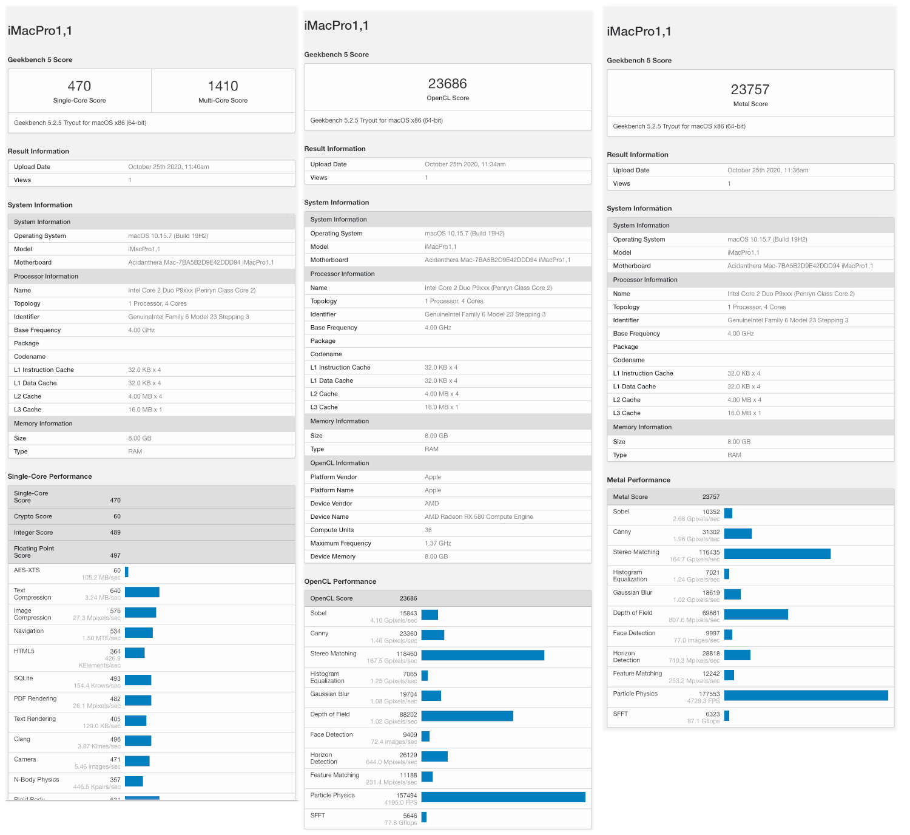

README.md
# KVM Hackntosh set up

This is my guide on how to set up a Hackintosh on Virt-Manager.

I've used Kholia's repository which utilised the newer OpenCore firmware method over the old Clover method.

1. [Hardware](#hardware)
2. [Download the required software](#Download-the-required-software)
  * [ProperTree](#ProperTree)
3. [Create the virtual machine](#Create-the-virtual-machine)
  * [CPUs](#CPUs)
  * [Memory](#Memory)
  * [Storage](#Storage)
  * [Add the physical hardware](#Add-the-physical-hardware)
  * [Remove HDA audio](#Remove-HDA-audio)
4. [Find your Ethernet MAC address](#Find-your-Ethernet-MAC-address)
5. [Modify the config.plist](#Modify-the-configplist)
6. [Issues](#Issues)
  * [HDMI 2.0](#HDMI-20)
    - [Changing the framebuffer](#Changing-the-framebuffer)
  * [Weird UI behaviour](#Weird-UI-behaviour)
7. [Screenshots](#Screenshots)
  * [Timezone](#Timezone)
  * [Mouse settings](#Mouse-settings)
  * [GeekBench 5](GeekBench-5)

## [Hardware](#hardware)

My machine is quite old, but it still works.

* FX-8350 CPU.
* Radeon RX580 GPU.
* Fresco FL1100 based USB PCI-e card.
* RTL8153 USB Ethernet attached to USB card.
* LG UK850-W 4K HDR monitor.

## Download the required software

```
$ git clone https@github.com:Lucretia/hack-howto.git
$ cd hack-howto
$ git clone https://github.com/corpnewt/GenSMBIOS
$ git clone https://github.com/corpnewt/ProperTree
$ git clone https://github.com/kholia/OSX-KVM
$ cd OSX-KVM
$ ./fetch-macOS.py
./fetch-macOS.py # Removed the feching stuff from this log
 #    ProductID    Version   Post Date  Title
 1    061-26578    10.14.5  2019-10-14  macOS Mojave
 2    061-26589    10.14.6  2019-10-14  macOS Mojave
 3    041-91758    10.13.6  2019-10-19  macOS High Sierra
 4    041-88800    10.14.4  2019-10-23  macOS Mojave
 5    041-90855    10.13.5  2019-10-23  Install macOS High Sierra Beta
 6    061-86291    10.15.3  2020-03-23  macOS Catalina
 7    001-04366    10.15.4  2020-05-04  macOS Catalina
 8    001-15219    10.15.5  2020-06-15  macOS Catalina
 9    001-36735    10.15.6  2020-08-06  macOS Catalina
10    001-36801    10.15.6  2020-08-12  macOS Catalina
11    001-51042    10.15.7  2020-09-24  macOS Catalina

Choose a product to download (1-11): 11
qemu-img convert OpenCore-Catalina/OpenCore.qcow -O raw ../../OpenCore-Catalina/OpenCore.raw
```

### ProperTree

**N.B** Beware that ProperTree does not have a scalable UI and is tiny on HiDPI screens.

If ProperTree complains about ```BACKGROUND``` do the following:

```
$ xrdb -load /dev/null
```

## [Create the virtual machine](#create-vm)

Import the Virt-Manager XML template as per the Kholia instructions.

### CPUs

Set up the CPU's with how many cores/threads you want, mine is currently set up:



```
  <vcpu placement="static">4</vcpu>
  <cpu mode="host-model" check="none">
    <topology sockets="1" dies="1" cores="4" threads="1"/>
  </cpu>
```

With a higher spec machine, i.e. Ryzen Threadripper, you could increase this to match what a real Mac would have.

### Memory

I have set up my memory requirements to 8192 MiB (8GB), if you have more, add it.

### Storage

Add the ```BaseSystem.img``` as a **USB** drive, not a hard drive, otherwise you cannot boot the VM into the installer. Kholia does not mention this anywhere.


```
<disk type="file" device="disk">
  <driver name="qemu" type="raw" cache="writeback" io="threads"/>
  <source file="<path-to>/hack-howto/OpenCore-Catalina/OpenCore.raw"/>
  <target dev="sda" bus="usb"/>
  <boot order="1"/>
  <address type="usb" bus="0" port="2"/>
</disk>
<disk type="file" device="disk">
  <driver name="qemu" type="raw"/>
  <source file="<path-to>/hack-howto/macos-vm/OSX-KVM/BaseSystem.img"/>
  <target dev="sdc" bus="usb"/>
  <boot order="2"/>
  <address type="usb" bus="0" port="4"/>
</disk>
<disk type="file" device="disk">
  <driver name="qemu" type="raw" cache="none" io="threads" discard="unmap" detect_zeroes="unmap"/>
  <source file="<path-to>/catalina.raw"/>
  <target dev="sdb" bus="sata"/>
  <boot order="4"/>
  <address type="drive" controller="0" bus="0" target="0" unit="1"/>
</disk>
```

You can repack ```OpenCore.raw``` to qcow2 if you want to save space.

You really want the base OS SATA drive stored on an SSD drive. I have an SSD drive mount inside ```/var/lib/libvirt/images``` which is where I store all my OS images.

I've added an extra data drive which I can mount inside Linux if I need to, this can be VFAT or HFS+, Linux does not have an APFS driver yet.

### Add the physical hardware

I have 3 PCI devices I want to pass through, you need to make sure your devices are set up into separate IOMMU goups.

```
<!-- Add your GPU like this, this specific to my VM, you may need to modify the bus numbers in the address tag, don't modify any other parameters in that tag -->
<hostdev mode="subsystem" type="pci" managed="yes">
  <driver name="vfio"/>
  <source>
    <address domain="0x0000" bus="0x03" slot="0x00" function="0x0"/>
  </source>
  <!-- GPU's have 2 functions, video and audio -->
  <address type="pci" domain="0x0000" bus="0x01" slot="0x00" function="0x0" multifunction="on"/>
</hostdev>

<!-- GPU Audio device -->
<hostdev mode="subsystem" type="pci" managed="yes">
  <driver name="vfio"/>
  <source>
    <address domain="0x0000" bus="0x03" slot="0x00" function="0x1"/>
  </source>
  <address type="pci" domain="0x0000" bus="0x01" slot="0x00" function="0x1"/>
</hostdev>

<!-- My USB PCI-e card -->
<hostdev mode="subsystem" type="pci" managed="yes">
  <driver name="vfio"/>
  <source>
    <address domain="0x0000" bus="0x02" slot="0x00" function="0x0"/>
  </source>
  <address type="pci" domain="0x0000" bus="0x03" slot="0x00" function="0x0"/>
</hostdev>
```

### Remove HDA audio

MacOS doesn't seem to like the HDA device that QEMU provides, I've tried all of the hardware provided and none work. Apparently, if you do get it working it's not the best anyway. I ended up just using HDMI audio, but this is no good if you don't have speakers on your monitor.

## Find your Ethernet MAC address

```
$ ip a  # Output trimmed
2: eth0: <BROADCAST,MULTICAST,UP,LOWER_UP> mtu 1500 qdisc pfifo_fast state UP group default qlen 1000
    link/ether AA:BB:CC:DD:EE:FF brd ff:ff:ff:ff:ff:ff
#              ^^^^^^^^^^^^^^^^^
```

or
```
$ ifconfig  # Output trimmed
eth0: flags=4163<UP,BROADCAST,RUNNING,MULTICAST>  mtu 1500
        inet 192.168.0.30  netmask 255.255.255.0  broadcast 192.168.0.255
        ether AA:BB:CC:DD:EE:FF  txqueuelen 1000  (Ethernet)
#             ^^^^^^^^^^^^^^^^^
```

## Modify the config.plist

```
$ mkdir -p mnt/opencore
$ sudo mount OSX-KVM/OpenCore-Catalina/OpenCore.raw -o loop,offset=$((010*2048)) mnt/opencore
```

Generate your SMBIOS, select option 3 and give either ```iMacPro1,1``` or ```MacPro7,1``` as the SMBIOS when asked:

```
$ python GenSMBIOS/GenSMBIOS.command
```

Make a note of it as the tool clears the screen. Place the data into your config list:

```
        </dict>
        <key>PlatformInfo</key>
        <dict>
                <key>Automatic</key>
                <true/>
                <key>Generic</key>
                <dict>
                        <key>AdviseWindows</key>
                        <false/>
                        <key>MLB</key>
                        <string>**Board Serial**</string>
                        <key>ROM</key>
                        <data>**Ethernet MAC without colons, e.g. AABBCCDDEEFF**</data>
                        <key>SpoofVendor</key>
                        <true/>
                        <key>SystemProductName</key>
                        <string>SMBIOS</string>
                        <key>SystemSerialNumber</key>
                        <string>**Serial**</string>
                        <key>SystemUUID</key>
                        <string>**SmUUID**</string>
                </dict>
```

## Issues

### HDMI 2.0

On booting the machine the OS will set you up with an accelerated framebuffer, it's the default one ```AMDFrameBuffer``` which is generated on the fly. I cannot get HDMI 2.0 to work to get HiDPI screen resolutions and the Display settings doesn't show the HiDPI settings, only the scalable ones.




#### Changing the framebuffer

I even changed the framebuffer to ```Orinoco``` which used to be selected by Mojave, the UI does feel faster, but there seems to be some weird glitches when I run my Particle Designer and click in the OpenGL window to place the emitter, but it is old, so I'll try the demo of the newest release to see.

In your config.plist, under ```DeviceProperties > Add```, add the following which was taken from [this post](https://forums.macrumors.com/threads/tired-of-low-geekbench-scores-use-radeonboost.2231366/post-28735099); the ```shikigva``` option there is not required.


```
        <key>DeviceProperties</key>
        <dict>
                <key>Add</key>
                <dict>
                        <!-- Insert this section -->
                        <key>PciRoot(0x1)/Pci(0x1,0x0)/Pci(0x0,0x0)</key>
                        <dict>
                                <key>@0,name</key>
                                <data>QVRZLE9yaW5vY28=</data>
                                <key>ATY,EFIVersion</key>
                                <data>MDEuMDEuMTgz</data>
                                <key>CFG,CFG_FB_LIMIT</key>
                                <data>BQ==</data>
                                <key>CFG,CFG_PTPL2_TBL</key>
                                <data>ggAAAHwAAAB2AAAAcAAAAGoAAABkAAAAXgAAAFgAAABSAAAATAAAAEYAAABAAAAAOgAAADQAAAAuAAAAKAAAAA==</data>
                                <key>PP,PP_PowerPlayEnabled</key>
                                <data>AQAAAA==</data>
                                <key>PP,PP_WorkLoadPolicyMask</key>
                                <data>CA==</data>
                                <key>agdpmod</key>
                                <data>cGlrZXJhAA==</data>
                                <key>model</key>
                                <data>QU1EIFJhZGVvbiBSWCA1ODA=</data>
                                <key>rebuild-device-tree</key>
                                <data>AA==</data>
                        </dict>
                        <!-- End -->
                </dict>
                <key>Delete</key>
                <dict>
                        <!-- Insert this section -->
                        <key>PciRoot(0x1)/Pci(0x1,0x0)/Pci(0x0,0x0)</key>
                        <array>
                                <string>ATY,EFIVersion</string>
                        </array>
                        <!-- End -->
                </dict>
        </dict>
```

Those PCI addresses are taken from within the Mac, if you set up your GPU as PCI 01:00.0 as I did, these will work.

Back to HDMI, I tried to enable it using ```WhateverGreen.kext```, which needs to add ```-cdfon```  to the ```boot-args``` parameter.

```
        <key>NVRAM</key>
        <dict>
                <key>Add</key>
                <dict>
                        <key>7C436110-AB2A-4BBB-A880-FE41995C9F82</key>
                        <dict>
                                <key>boot-args</key>
                                <!-- Insert this section -->
                                <string>-v keepsyms=1 -cdfon</string>
                                <!-- End -->
                        </dict>
                </dict>
        </dict>
```

And then setting the ```enable-hdmi2``` device property.

```
        <key>DeviceProperties</key>
        <dict>
                <key>Add</key>
                <dict>
                        <key>PciRoot(0x1)/Pci(0x1,0x0)/Pci(0x0,0x0)</key>
                        <dict>
                                <!-- Insert this section -->
                                <key>enable-hdmi20</key>
                                <data>AQ==</data>
                                <!-- End -->
                        </dict>
                </dict>
        </dict>
```

**Note** that neither of these options worked for me.

### Weird UI behaviour

I just booted into the VM and when opening item lists in in the IORegistryExplorer they would close automatically, I then went back to Linux to ssh into the machine and it locked up. Went back in and whole machine had locked up. Possibly a USB power issue caused by the Orinoco framebuffer?

### Suspended VM

You may leave your VM and come back to it later only to find you've got a black screen and mouse or keyboard won't wake it up.



To wake it up, do the following:

```
$ virsh --connect qemu:///system dompmwakeup --domain Catalina
Domain Catalina successfully woken up
```

### No USB redirect after wakeup

Well, my VM suspended and I wanted to test passing through an iPhone via the QEM interface - not the USB PCI-e card, but the options were greyed out. So, reboot time and it's not the fastest boot with OC, once it gets to the picker, it's pretty fast.

Turns out, this is true after a reboot. Maybe it's because I removed the default display devices?

## Screenshots


### Timezone

This defaulted to the US instead of my locality, this can be changed using the clock in the menu bar.



### Mouse settings

Apple seems to think that their mouse scrolling is natural, well, it's not, here's how to fix it.



Their default tracking speed is way too slow, I cannot imagine using that on a full 4K screen, it'd take ages to get from one side to the other!

### Enable remote login

You will likely want to remote login to your Mac, so you need to enable it in the settings.



Then copy over your SSH key.

```
$ ssh-copy-id $(whoami)@192.168.0.14  # Edit the IP address.
```

### Attaching iPhone

Attached my iPhone to the VM via the USB PCI-e card, seems to be ok.



### GeekBench 5



## References

* [Kholia](https://github.com/kholia/OSX-KVM)
* [OpenCore Installation Guide](https://dortania.github.io/OpenCore-Install-Guide)
* [IORegistryExplorer](https://github.com/vulgo/IORegistryExplorer)
* [VDADecoderChcker](https://dortania.github.io/OpenCore-Post-Install/universal/drm.html#testing-hardware-acceleration-and-decoding)
* [EveryMac.com](https://everymac.com)
